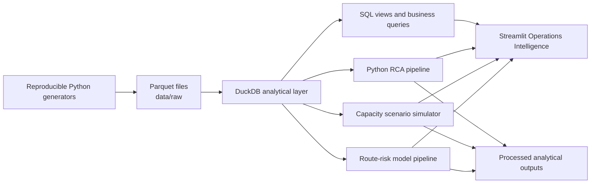
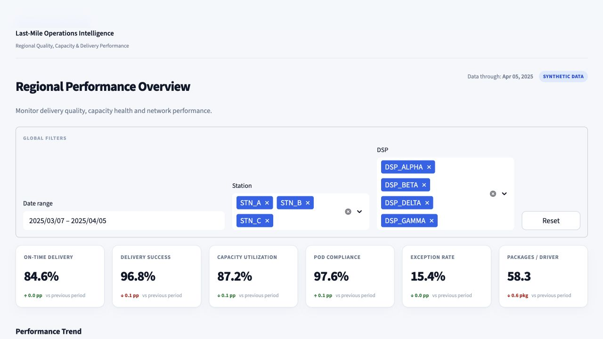

# Last-Mile Regional Quality Intelligence System

> A portfolio-grade operations intelligence platform connecting synthetic last-mile data to KPI monitoring, SQL analytics, root-cause diagnosis, capacity scenarios, and pre-dispatch route-risk scoring.

[](https://www.python.org/)
[](https://duckdb.org/)
[](https://streamlit.io/)
[](#how-to-run)
[](#data-confidentiality-disclaimer)

## Executive Summary

This project demonstrates how an operations strategy and analytics team could build a regional last-mile performance management system end to end. It converts 90 days of reproducible, package-level synthetic data into:

- a governed KPI layer in DuckDB and SQL;
- repeatable root-cause and trend analysis in Python;
- a capacity reallocation scenario simulator;
- a leakage-aware prototype for identifying high-risk routes before dispatch; and
- a polished five-page Streamlit control tower for operations leadership.

The system connects data engineering, metric definition, operational diagnosis, scenario analysis, and executive communication—moving from reporting **what happened** to explaining **why it happened** and evaluating **what could be done next**.

## Business Problem

Regional last-mile leaders need a consistent way to answer questions that often span multiple operational datasets:

- Is service quality deteriorating, and where?
- Which DSPs, stations, routes, or drivers require attention?
- Are pickup delays, capacity pressure, route design, or execution reliability driving the change?
- Can volume be redistributed without creating a new bottleneck?
- Which routes exhibit elevated late-delivery risk before dispatch?

Disconnected spreadsheets and isolated metrics make these questions difficult to answer consistently. This project creates one analytical workflow in which route execution, package outcomes, provider performance, capacity, and risk can be evaluated together.

## Why This Matters in Last-Mile Logistics

Last-mile networks operate under tight time windows, variable demand, distributed workforces, and interdependent capacity constraints. A pickup delay or overloaded route can propagate into missed windows, higher exception volume, customer impact, and expensive recovery actions.

Capacity utilization, route density, pickup compliance, service quality, exception Pareto analysis, and provider benchmarking are real-world logistics concepts. **The companies, identifiers, records, metric values, model results, and findings in this repository are entirely synthetic and do not describe any real organization.**

## System Architecture



Design principles:

- **Reproducible:** fixed random seed and deterministic generation configuration.
- **Modular:** generation, SQL, analytics, models, UI, and tests are separated.
- **Decision-oriented:** every analytical layer connects to an operational question.
- **Leakage-aware:** route-risk features are limited to signals available before dispatch or at route start.
- **Portfolio-safe:** fictional identifiers and explicit confidentiality controls are used throughout.

## Synthetic Dataset Design

The generator creates a fictional regional network with realistic operating relationships rather than independent random values.

| Dimension | Synthetic design |
|---|---:|
| Analysis period | 90 days: 2025-01-06 through 2025-04-05 |
| Stations | 3 fictional nodes |
| DSPs | 4 fictional providers |
| Drivers | 100 fictional drivers |
| Routes | 5,347 |
| Package deliveries | 237,891 |
| Random seed | `20250317` |

Embedded synthetic behavior includes lower route density increasing late-delivery risk, service degradation at high utilization, pickup delay reducing OTD, driver reliability influencing outcomes, fictional station/DSP differences, weekday and peak effects, and sparse injected anomalies.

No ZIP codes, customer details, real driver details, pricing data, or real operational identifiers are generated.

## Database Schema

| Table | Grain | Key fields | Purpose |
|---|---|---|---|
| `stations` | One row per fictional station | `station_id` | Region and market classification |
| `delivery_service_providers` | One row per fictional DSP | `provider_id` | Contracted capacity and active drivers |
| `drivers` | One row per fictional driver | `driver_id`, `provider_id` | Tenure, attendance, historical reliability |
| `routes` | One row per route/date | `route_id` | Volume, distance, density, capacity, pickup delay |
| `deliveries` | One row per synthetic package | `package_id`, `route_id` | Status, timing, POD compliance, exceptions |

```text
Station ─┬─ Route ─── Delivery
         │     └──── Driver
DSP ─────┴─────────── Driver
```

A detailed field-level data dictionary is produced with the raw dataset.

## KPI Framework

| KPI | Decision use |
|---|---|
| On-Time Delivery Rate | Delivery-window execution |
| Delivery Success Rate | Successfully completed package outcomes |
| POD Compliance Rate | Proof-of-delivery process adherence |
| Exception Rate | Package-level operational failure signals |
| Pickup Compliance Rate | Dispatch and pickup execution |
| Capacity Utilization | Overload and underuse |
| Packages per Driver | Labor productivity and allocation efficiency |
| Average Pickup Delay | Upstream execution pressure |
| Route Completion Rate | Route-level completion quality |
| Driver Reliability | Historical attendance and delivery-success signal |
| Average Route Density | Route-design and productivity context |

Metrics are package- or route-weighted according to their operating meaning. Automated tests validate core calculations.

## SQL Analytics

DuckDB provides the analytical serving layer through six reusable views:

- `route_performance`
- `dsp_performance`
- `station_performance`
- `daily_regional_performance`
- `driver_performance`
- `exception_analysis`

The SQL demonstrates joins, CTEs, conditional aggregation, window functions, rolling averages, ranking, historical baselines, and threshold segmentation. Ten business queries investigate persistent DSP underperformance, station exceptions, capacity breakpoints, pickup-delay effects, route anomalies, recent deterioration, demand-capacity gaps, and density performance.

## Root Cause Analysis

The modular pipeline in `src/analytics/rca/` includes:

- correlation and segmented KPI analysis;
- data-derived threshold analysis;
- week-over-week trends and rolling averages;
- z-score anomaly detection;
- exception Pareto analysis; and
- DSP/station benchmarking.

An insight generator converts calculated results into operating language suitable for a regional review. Thresholds and deltas are calculated from the synthetic dataset—not hard-coded.

## Capacity Planning Simulation

The scenario engine evaluates a constrained package transfer from an overloaded fictional DSP to a receiving DSP with available capacity. It compares before and after estimates for utilization, expected OTD, packages per driver, and exception risk.

The output is framed as a scenario, not a deterministic optimization decision. It identifies trade-offs, receiving-capacity limits, and residual overload using relationships observed in this project's synthetic history.

> Scenario results are estimates based on historical relationships within synthetic project data and should not be interpreted as production optimization recommendations.

## Predictive Route Risk Model

The Late Delivery Risk Model is **a prototype demonstrating how pre-dispatch operational signals can be used to identify potentially high-risk routes.**

Logistic Regression and Random Forest are compared using only signals available before dispatch or at route start: planned volume, expected utilization, distance, density, pickup delay, historical driver/DSP/station performance, and day of week. Chronological train, validation, and holdout windows reduce temporal leakage risk.

| Model | Holdout ROC-AUC | Precision | Recall | F1 |
|---|---:|---:|---:|---:|
| Logistic Regression | 0.902 | 0.760 | 0.805 | 0.782 |
| Random Forest | 0.892 | 0.767 | 0.779 | 0.773 |

The selected prototype outputs a route-level risk score, Low/Medium/High tier, and feature importance. These metrics are synthetic portfolio results—not evidence of production model performance.

## Streamlit Dashboard

The dashboard is designed as a modern internal operations product rather than a collection of disconnected charts:

1. **Executive Overview** — regional KPIs, OTD trend, station ranking, DSP leaderboard, and utilization-versus-quality analysis.
2. **Station & DSP Performance** — provider drill-down, configurable trends, and route-level execution detail.
3. **Root Cause Analysis** — dynamic findings, threshold bands, Pareto, and anomaly alerts.
4. **Capacity Planning** — interactive reallocation controls and before-versus-after impact preview.
5. **Route Risk** — route watchlist, risk distribution, primary factors, and compact model diagnostics.

Reusable components provide consistent filters, KPI cards, insight cards, status badges, chart styling, page headers, and synthetic-data messaging. DuckDB queries, processed datasets, and model artifacts are cached for responsive interaction.

## Key Synthetic Findings

The following results were calculated from generated data and demonstrate operational reasoning only:

- Regional synthetic OTD was **84.5%**, delivery success **96.8%**, and exception rate **15.5%**.
- Above a data-derived **102.1% utilization threshold**, average OTD was **7.7 percentage points lower**.
- Above a data-derived **16.4-minute pickup-delay threshold**, average OTD was **12.1 percentage points lower**.
- Fictional `DSP_GAMMA` had the lowest synthetic OTD at **75.3%**, **9.2 points below** the regional result.
- Fictional `STN_B` had the highest synthetic station exception rate at **22.3%**.
- The rolling monitor identified **31 synthetic OTD-drop or exception-spike events**.
- `LATE_DELIVERY` represented **77.0%** of synthetic exceptions.

These are **synthetic project findings**, not observations, estimates, or claims about a real logistics network.

## Technology Stack

| Layer | Technology |
|---|---|
| Data generation | Python, pandas, NumPy |
| Storage | Parquet |
| Analytical database | DuckDB |
| Analytics | SQL, pandas |
| Predictive modeling | scikit-learn, joblib |
| Application | Streamlit |
| Visualization | Plotly |
| Quality assurance | pytest, Streamlit AppTest |

## Repository Structure

```text
last-mile-quality-intelligence/
├── .streamlit/              # Theme configuration
├── app/
│   ├── app.py               # Application entry point
│   ├── components/          # Reusable UI components
│   ├── pages/               # Five dashboard workflows
│   └── styles/              # Shared design system
├── data/
│   ├── raw/                 # Generated Parquet files
│   └── processed/           # Reproducible analytics/model outputs
├── docs/images/             # README screenshots
├── notebooks/               # Exploratory workspace
├── sql/
│   ├── views/               # Six analytical views
│   └── queries/             # Ten business questions
├── src/
│   ├── analytics/           # KPI, RCA, database, capacity modules
│   ├── data_generation/     # Synthetic-data generators
│   ├── models/              # Route-risk pipeline
│   └── utils/               # Shared utilities
├── tests/                   # Unit, integration, dashboard tests
├── generate_data.py
├── build_database.py
├── run_root_cause_analysis.py
├── run_capacity_simulation.py
├── run_late_delivery_model.py
├── main.py
└── requirements.txt
```

## How to Run

Python 3.9+ is supported; Python 3.11 is recommended.

```bash
git clone https://github.com/yingchi0619/last-mile-quality-intelligence.git
cd last-mile-quality-intelligence
python3 -m venv .venv
source .venv/bin/activate
python -m pip install --upgrade pip
python -m pip install -r requirements.txt
```

Build the reproducible project layers:

```bash
python generate_data.py
python build_database.py
python run_root_cause_analysis.py
python run_capacity_simulation.py
python run_late_delivery_model.py
```

Validate and launch:

```bash
python main.py
pytest -q
streamlit run app/app.py
```

Open `http://localhost:8501`. On Windows PowerShell, activate with `.venv\Scripts\Activate.ps1`.

## Screenshots

### Executive Overview


### Root Cause Analysis



### Capacity Planning Simulator


## Future Improvements

- Add data-quality observability and generation-drift checks.
- Introduce configurable service targets by market and period.
- Extend capacity scenarios to route feasibility, driver hours, and multi-DSP optimization.
- Add probability calibration, model-drift monitoring, and individual route explanations.
- Add forecast-based staffing and volume planning.
- Package the workflow with containerization and CI/CD.
- Add role-aware views for regional, station, and analytics users.

## Data Confidentiality Disclaimer

> **“This project uses entirely synthetic data created for portfolio demonstration purposes. It does not contain proprietary, confidential, customer, driver, route, pricing, or operational data from any current or former employer.”**

Every company, station, DSP, driver, route, package, timestamp, operating condition, metric, anomaly, recommendation, and model result in this repository is fictional. References to real-world logistics concepts describe general analytical methods only and must not be interpreted as representing the policies, systems, performance, or data of any actual company.

No real employer names or internal company information are used, inferred, reconstructed, or implied.

---

Built as a professional portfolio demonstration of SQL, Python, KPI development, root-cause analysis, operational decision support, process optimization, capacity planning, predictive analytics, and cross-functional thinking.
